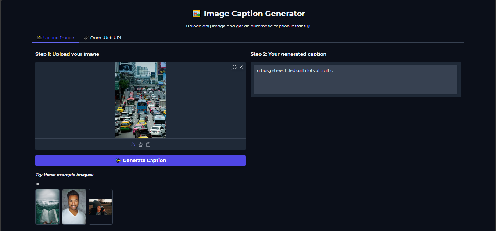
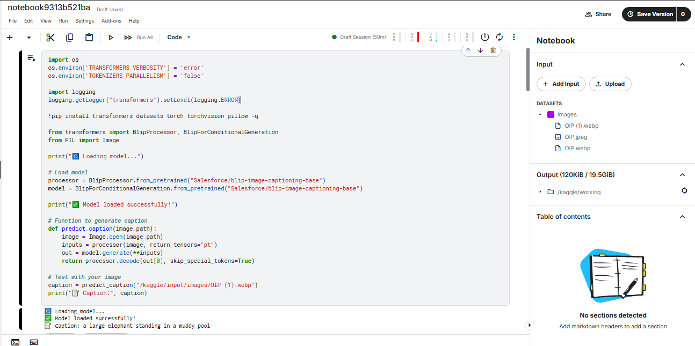

# 🖼️ Image Caption Generator

This project is a **Deep Learning–based Image Captioning System** built using the **BLIP (Salesforce/blip-image-captioning-base)** model. It generates a caption for any given input image.

The project includes:

* Backend code (model loading + caption generation)
* A clean **Gradio interface** for user interaction
* Sample output images 
* Step‑by‑step setup instructions for **Kaggle** and **local machines**

---

## 🚀 Features

* Generates captions using a pretrained BLIP model
* Supports both **image upload** and **image URL input**
* Works on **Kaggle GPU (T4)** or any system with PyTorch
* Simple Gradio UI
* Easy to modify and extend

---

## 📂 Project Structure

Image-Caption-Generator/
│
├── backend_captioning_code.py       # Backend model + caption generation code
├── gradio_interface.py              # Gradio UI for captioning
├── ImageCaption.ipynb               # Jupyter Notebook version
├── requirements.txt                 # Python dependencies
│
├── output_samples/                  # Folder containing sample output images
│   ├── 1.PNG
│   ├── 2.PNG
│   └── .gitkeep
│
├── .gitattributes                   # Git settings
└── README.md                        # Project documentation

---

## 🛠️ Requirements

Create a **requirements.txt** file with the following:

```
transformers
torch
torchvision
pillow
gradi o
requests
```

---

## 📥 Running the Project on Kaggle

Follow these steps to run the project successfully.

### **1️⃣ Open Kaggle Notebook**

* Go to **Kaggle → Notebooks**
* Create a **New Notebook**
* Enable **Accelerator → GPU (T4)**

### **2️⃣ Upload Your Input Image**

You can add your own image:

* Left sidebar → **Add Data** → **Upload File** → Choose your image
* After upload, Kaggle creates a folder path like:

```
/kaggle/input/yourimagename/your_image.jpg
```

### **3️⃣ Add Image Path in Backend Code**

In your backend code, change the following line:

```python
caption = predict_caption("/kaggle/input/yourfoldername/your_image.jpg")
```

Replace:

* `yourfoldername` → the name of the uploaded dataset folder
* `your_image.jpg` → your actual image file name

This is **mandatory** for the model to read your input.

### Example:

```python
caption = predict_caption("/kaggle/input/dogphoto/dog.png")
```

### **4️⃣ Run the Backend Code**

The model loads BLIP and generates the caption.

---

## 🖥️ Gradio Interface

To launch the interactive UI:

* Scroll to the Gradio block section
* Run the interface cell
* A public shareable link will appear

Users can:

* Upload an image
* Paste an image URL
* Get instant captions

---

## 🧪 Sample Output Images

These are sample output images generated during testing.

### **🖼️ Output 1**




### **🖼️ Output 2**



---

## 🧩 How the Backend Works

### **1. Load Pretrained Model**

```python
processor = BlipProcessor.from_pretrained("Salesforce/blip-image-captioning-base")
model = BlipForConditionalGeneration.from_pretrained("Salesforce/blip-image-captioning-base")
```

### **2. Generate Caption**

```python
def predict_caption(image_path):
    image = Image.open(image_path)
    inputs = processor(image, return_tensors="pt")
    out = model.generate(**inputs)
    return processor.decode(out[0], skip_special_tokens=True)
```

### **3. Run on Your Image**

```python
caption = predict_caption("/kaggle/input/yourfolder/image.jpg")
print(caption)
```

---

## 📌 Notes

* Doesn’t require the dataset — only **one input image** is enough
* You just need to update the image path in the code
* Works offline after model download

---

## 📞 Contact

Created by RakRox For improvements, open an issue or submit a pull request.

---

⭐ *If you like this project, consider giving it a star on GitHub!*
